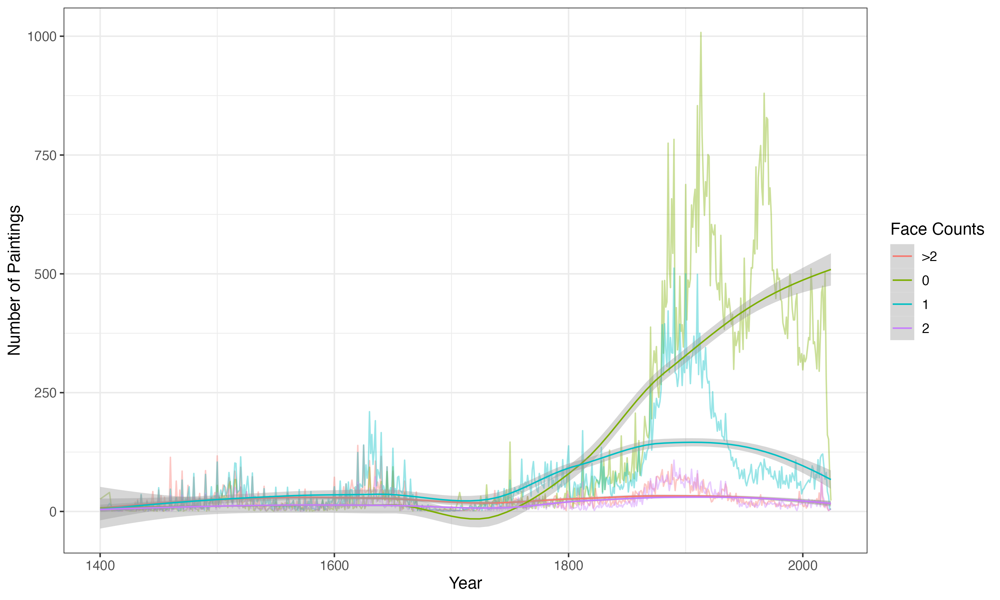
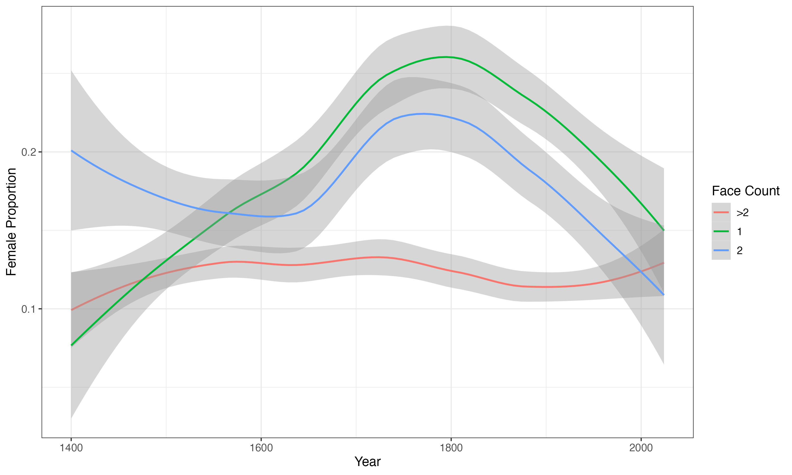
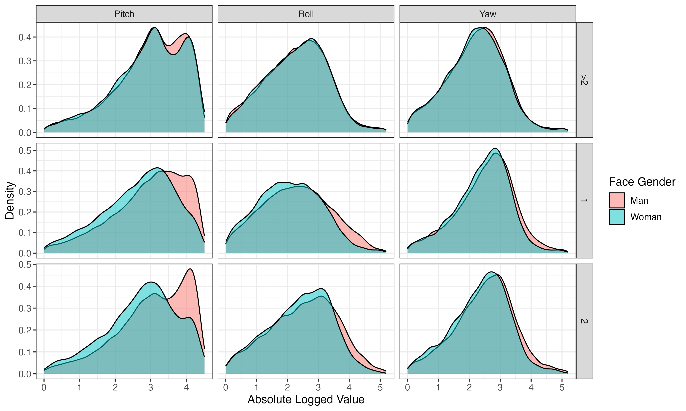
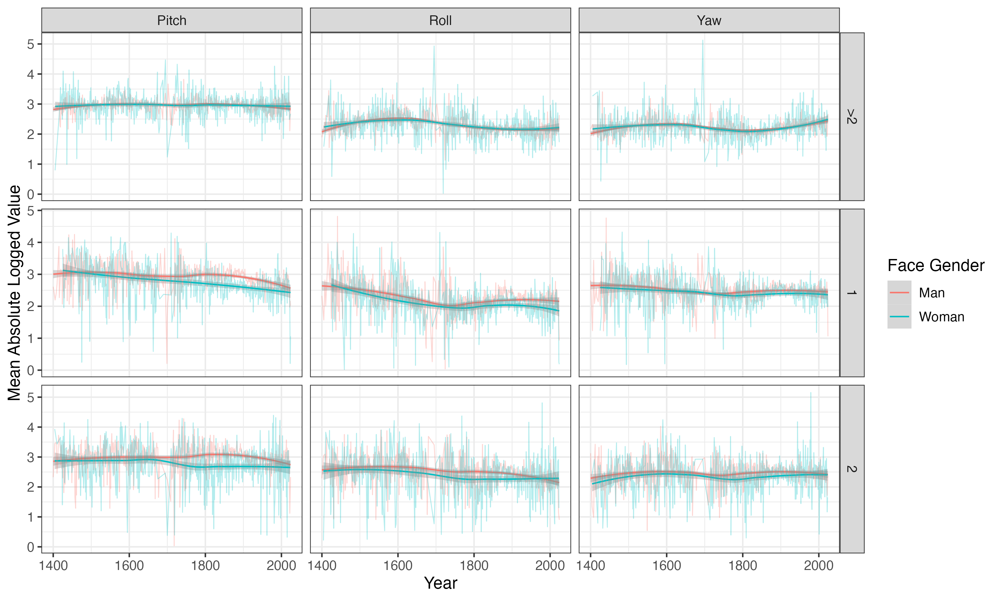
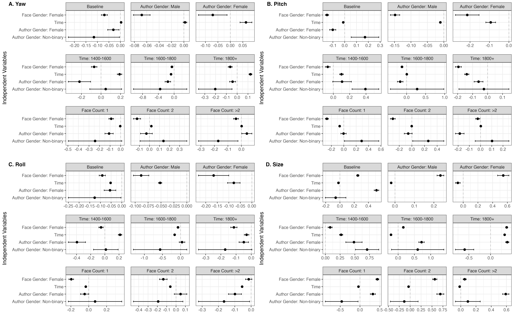

# gendered_painting

Author: Yangyu Wang

Date: Apr 13. 2025

## Research Intuitives

This is the coursework for MACS30200, on the gender representations in paintings.

## Result Snapshots

1. Face Counts Trend

2. Gender Face Counts Trend

3. Gender Posture Density

4. Gender Posture Trend

5. Gender Posture Trend (Regression Tests)

## Materials

Data are in [data](data), codes are in [code](code), and visualizations see [Img](Img).
