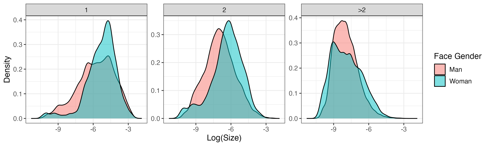
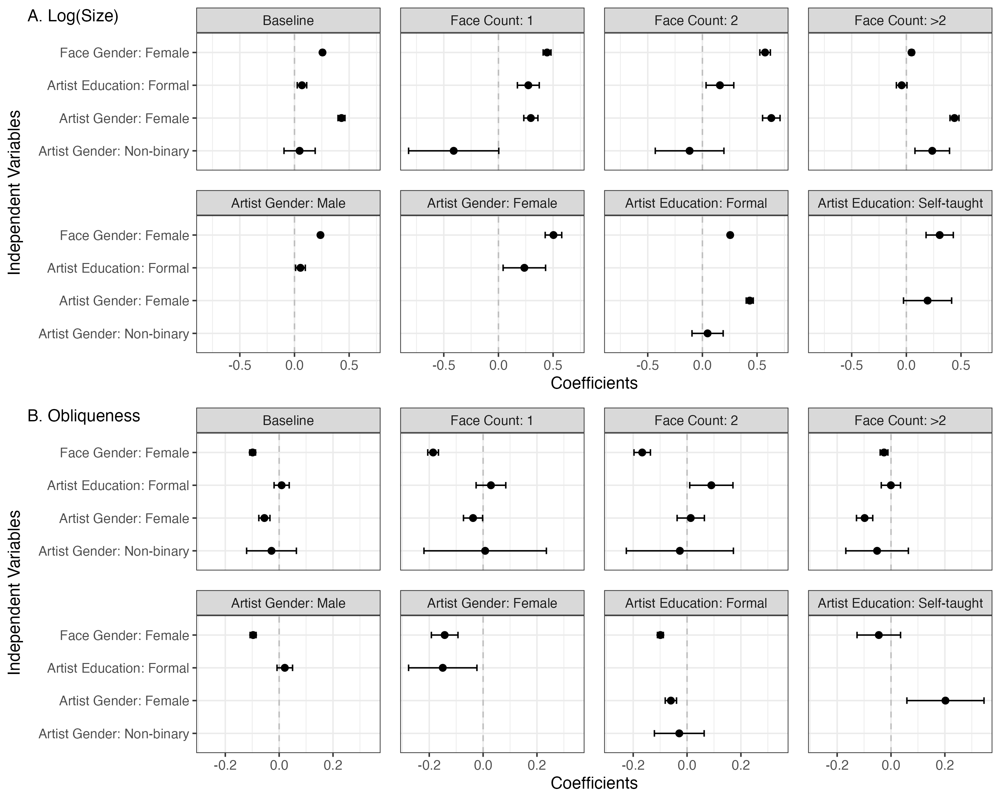
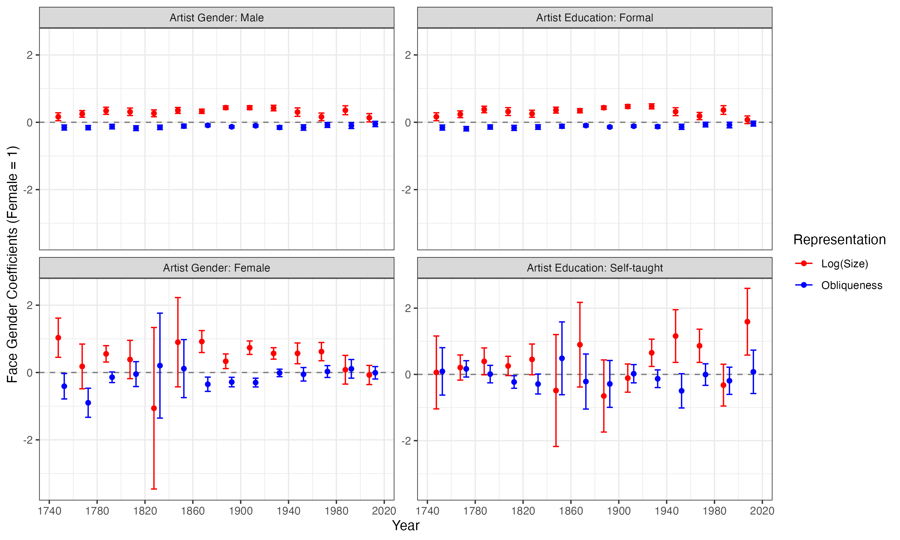

# gendered_painting

Author: Yangyu Wang

Date: Apr 13. 2025

## Research Intuitives

This is the coursework for MACS30200, on the gender representations in paintings.


## Result Snapshots

1. Face Counts Trend


2. Female Face Proportion Trend


3. Gender Size and Obliqueness Density



4. Gender Size and Obliqueness Trend


5. Gender Gap in Size and Obliqueness 


6. Trend of Gender Gap in Size and Obliqueness 



## Materials

Data are in [data](data), codes are in [code](code), and visualizations see [Img](Img).

## Requirements for running

Please run the following lines before running the code.

In terminal, please run:
```bash
pip install -r Requirements.txt
```

In R, please run:
```r
source("Requirements.R")
```


